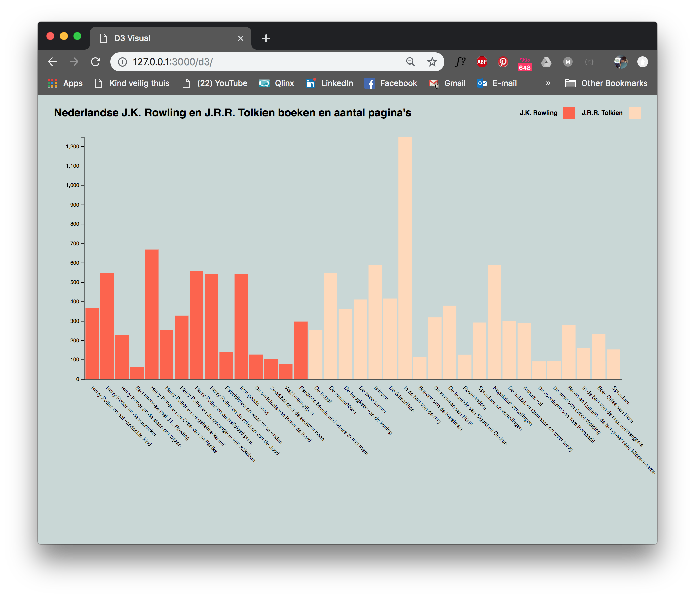

# Functional programming



## Table of contents

- [Installation](#installation)
- [Introduction](#introduction)    
  - [Questions](#questions)
  - [Hypothesis](#hypothesis)
- [Data](#data)
  - [API](#API)    
  - [Code](#code)  
- [Process](#process)
  - [First try](#first-try)
  - [Iterations](#iterations)    
  - [Conclusion](#conclusion)            
- [Todo](#todo)
- [Credits](#credits)
  - [Resources](#resources)
- [License](#license)     

- data: wat heb je geleerd van de data, inhoudelijk -> hp en lr
- inzichten tonen
- functies die crashen, bugs
- functional programming leering tonen, wat is functional binnen mijn ding
- duidelijk laten zien welke code ik zelf heb geschreven
- laten zien voor wat ik beter mn best heb gedaan

appl. 5.5 understand 4 quality 4 process 2.5

code aanpas naar nu
structuur aanpassen
readme benodigdheden
goede voorbeelden

## Resit

For the resit I updated my README.md because my first readme wasn't finished and didn't include my complete process. I hope this show more of my `understanding`,  `quality` and `process`.

I also changed the structure of my github repo because this was a hot mess.

My D3 files can be found in my D3 folder.

My server folder holds my index.js, this is where I connect to the API and collected the data.

## Installation
```bash
# Clone this repo
git clone https://github.com/maybuzz/frontend-data

# Create a .env file to store the key, you should get your own key to get access

touch .env
echo "PUBLIC=01234567890" >> .env

# Install node_modules

npm install

# Run the d3 folder with a static HTTP server
```

## Introduction

During this project we learned how to work with an API. For this project we used the API of the public library of Amsterdam (`OBA`). We learned how to connect to the API and get data. The first week was dedicated to doing research, formulate questions and collect data. The second week was dedicated to learning how to work with `D3`. This language is used for creating data visualizations.

#### Questions

Here I describe every question and explained why I didn't pick that one:

<details><summary>1. What day of the week most people come to the library to lend books?</summary>    


  This question could not be answered because we did not have access to this type of data due to privacy of users/customers


</details>

<details><summary>2. What time of year do the most books get published?</summary>    


  I must say I didn't really try to answer this question because this meant getting publish-data of every book in the OBA -which is almost impossible-. Instead of changing the question and adding some type of genre or something, I went on with another question.


</details>

<details><summary>3. Do writers nowadays write more or less books than 50/60 years ago?</summary>    


The reason I didn't proceed with this question is because I found it kind of hard to find this data. The OBA API contains all kinds of data, but not much about the author. For this question I should collect author data of modern book and older (50/60 year old) books. Then find out how many books were written by those writers. This is kind of hard -and not that interesting to me-.


</details>

<details><summary>4. Is there a connection to genres and the length of the titles?</summary>    


  This question I tried to answer for a day or something. I thought it would be fun to do something with genres and titles and this was one of the first things that I thought of. First I wanted to compare titles and summaries and maybe do something with the total pages too. After a while I noticed it didn't really get my any further. And this wasn't really interesting to me either...


</details>   

<details><summary>5. What is the connection of the average number of pages of the Harry Potter- and Lord of the Rings book series?</summary>    

  This time I thought of something that would interest me. I thought of books I liked and books I used to read when I was little. Soon I thought of Harry Potter. I read the whole series, in english too. Lord of the Rings is somewhat similar to Harry Potter. Wouldn't it be fun to compare the two? JK Rowling always interested me, so did JRR Tolkien. Eventually that is what I did; I compared the Harry Potter series by Rowling to Lord of the Rings and The Hobbit, by Tolkien.


</details>

I picked `question 5`.

####  Hypothesis

"The english Harry Potter series has a higher average number of pages than the dutch Harry Potter series." The same goes for Lord of the Rings.

"The complete Harry Potter series has a higher average number of pages than the Lord of the Rings series."

## Data

My final data visualization shows all the books written by JK Rowling and JRR Tolkien. I learned that a lot of books that come up in the API are not necessarily written by the author I'm looking for. A lot of Tolkien books are about his life and such. This wasn't really the case for JK Rowling.

When I looked for Lord of the Rings books, it came up with a lot of books about symbolism used in Lord of the Rings and side stories. This is very interesting, but not for my project.

### API and code

Here I tried collection all the books written by JK Rowling and JRR Tolkien.  

This didn't work the way I thought it would. I thought this would create 2 requests and put them together in the same object. This was not the case. It created 2 data objects, because it sends out 2 requests and I didn't put them together. When I was doing this, everyone was a bit busy, so I skipped it and went on to collect data from one writer at the time.

```js
axios.all([
  obaApi.getAll("search", {
       facet: "type(book)&facet=language(dut)",
       q: "author:J.K. Rowling",
       librarian: true,
       refine: true
     }),
  obaApi.getAll("search", {
      facet: "type(book)&facet=language(dut)",
      q: "author:J.R.R. Tolkien",
      librarian: true,
      refine: true
    })
])
```

I also switched the API I was using, from Folkert and Dennis, to Gijs his API, which is called `oba-api-gissa.js`.

This piece of code is from my `server/index.js` file and shows how I require and connect to the API using the `PUBLIC key` for authorization. I stored my keys in a `.env` file.

```js
const gissaApi = require("./oba-api-gissa.js")
const obaApi = new gissaApi({
  public: process.env.PUBLIC
})
```  

## Process

At the beginning I struggled with connecting to the API. I had to wait for Folkert Jan and Dennis to setup a connection I understood before I could really start my project.

At first I couldn't really think of anything to look for in the API. I didn't know the data in the API. Lucky for us Daniel vd Velde wrote a killer readme about the API and aquabrowser and everything needed to work with the API. This really helped me out. Dennis helped me out a lot and he used the Harry Potter series to show how the API works. This is where my idea came from. I switched it to the writer JK Rowling, and added the Lord of the Rings series by JRR Tolkien.

I wanted to create a visualization using the data from the aquabrowser. Because I didn't know how to yet, I collected the data page by page, writer by writer. I created a `data/data.json` file with my data, which I copied from the aquabrowser.

### First try

My first try (`tryouts/d3-first-try.js`) show my first data visualization. I used the API created by Folkert and Dennis. I used a [Lynda tutorial](https://www.lynda.com/D3-js-tutorials/Creating-meaninful-color-scales/594451/619567-4.html?srchtrk=index%3a3%0alinktypeid%3a2%0aq%3ad3%0apage%3a1%0as%3arelevance%0asa%3atrue%0aproducttypeid%3a2) to create a bar chart. This went well, until I found out it didn't really work the way it should. I was really proud of myself for getting this far by myself. I still don't know what the problem is, something went wrong with loading the data and some bars just wouldn't show... Titus told me to move on and use a different example-chart. Note that this was 2 days before the deadline, so I started panicking a bit...

### Iterations

After my first try I had to switch to a different example. Because I didn't have much time left, I asked my fellow students if they had a good example I could use. Chelsea helped me out. She, Linda and Jessie used the same example and they helped me create this chart. The example was in v4 so I had to change some things to make it work in v5.

During this project I tried collecting data in a few different ways. One of the first is shown in `API & code`

### Conclusion

When I look back at my process I think I could have done better. I can say that now 'cause it's been 2 weeks and we've been working with the API for much longer now. I wish I thought of some better questions and subject to research. Better luck next time.

Also I liked working with D3. I think it's cool that I'm able to create things using data.

I am not very happy with my product but oh well...

## To do

- [x] Write (english) README.md
- [x] Update `table-of-contents`
- [ ] Fix bugs in data, filter and fix mistakes
- [x] Get Dutch writer data (separate)
- [x] Push data to JSON file
- [ ] Get English writers data
- [ ] Get both (`JK Rowling`, `JRR Tolkien`) data at the same time
- [ ] Compare series (`Harry Potter`, `Lord of the Rings`, `De Hobbit`) by calculating average page number
- [x] Create D3 datavisualisation, `bar chart`
- [ ] `Bar chart` 2 ways; 1 way for each writer. Horizontal bars, vertical yAxis

## Credits

Titus Wormer [@wooorm](https://github.com/wooorm)    
`API` van Folkert-Jan vd Pol [@FJvdP](https://github.com/FJvdPol/functional-programming/blob/master/api/oba-api.js)    
`API` van Gijs Laarman [@gijslaarman](https://github.com/gijslaarman/functional-programming/blob/master/modules/oba-api/index.js)   
`Tips & Tricks` Dennis Wegereef [@Denniswegereef](https://github.com/denniswegereef)
`README.md` van Daniel vd Velde [@danielvandevelde](https://github.com/DanielvandeVelde/functional-programming/blob/master/README.md)
Chelsea, Linda and Jesse [@jesseDijkman1](https://github.com/jesseDijkman1?tab=followers) - I'm sorry I don't know the other github-handles -

### Resources

* [Lynda tutorial](https://www.lynda.com/D3-js-tutorials/Creating-meaninful-color-scales/594451/619567-4.html?srchtrk=index%3a3%0alinktypeid%3a2%0aq%3ad3%0apage%3a1%0as%3arelevance%0asa%3atrue%0aproducttypeid%3a2)
* [Uiteindlijke voorbeeld van Chelsea & Linda](https://bl.ocks.org/bricedev/0d95074b6d83a77dc3ad)

## License

MIT Luna May Johansson
